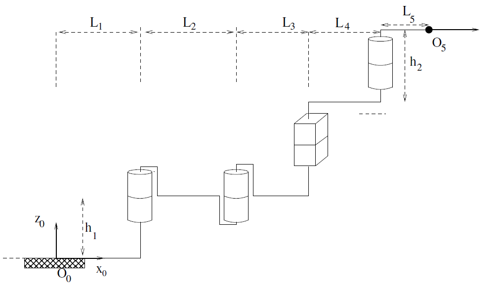
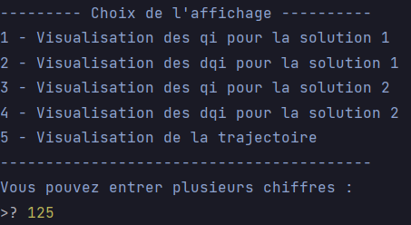

# Génération de trajectoires pour un robot manipulateur RRPR

---

Le projet est composé de 6 fichiers :
- [main.py](https://github.com/loanBRNT/bureauEtude/blob/main/main.py)
est le fichier à exécuter pour lancer le projet. Il contient notamment 
l'algorithme principal ainsi que la gestion de l'affichage.
- [donnee.py](https://github.com/loanBRNT/bureauEtude/blob/main/donnee.py)
contient l'ensemble des données du problème. Vous pouvez y modifier les 
constantes ainsi que les conditions initiales du robot.
- [mdi.py](https://github.com/loanBRNT/bureauEtude/blob/main/mdi.py)
contient la fonction pour le calcul du modèle différentiel inversé.
- [mgi.py](https://github.com/loanBRNT/bureauEtude/blob/main/mgi.py)
contient la fonction pour le calcul du modèle géométrique inversé.
- [mgd.py](https://github.com/loanBRNT/bureauEtude/blob/main/mgd.py)
contient la fonction pour le calcul du modèle géométrique direct.
- [traj.py](https://github.com/loanBRNT/bureauEtude/blob/main/traj.py)
contient la fonction de calcul de la trajectoire du robot.

### Comment simuler votre trajectoire ?

###### Etape 1 - Vérifiez les données du problème

Vous pouvez adapter les différentes constantes dans 
[donnee.py](https://github.com/loanBRNT/bureauEtude/blob/main/donnee.py) 
afin que la simulation respecte vos contraintes. Par défaut, toutes 
les constantes sont mises à 1. Vous pouvez aussi définir une nouvelle
position et orientation de départ.

###### Etape 2 - Executez main.py
Rien de plus simple ;-)
###### Etape 3 - Sélectionnez votre point d'arrivée et votre vitesse
Le programme va alors vous demander de saisir la position et l'orientation
de l'organe terminal que vous souhaitez. Il vous faudra aussi saisir la
vitesse du robot. Vos saisies seront vérifiées pour éviter des erreurs.

###### Etape 4 - Choisissez quelles courbes vous souhaitez observer
Vous allez pouvoir saisir un ou plusieurs chiffres pour sélectionner 
ce que vous voulez afficher à l'écran.

_Par exemple, ici, le programme affichera les qi et dqi de la première
solution ainsi que les différentes courbes liées à la position de
l'organe terminal en fonction du temps _(s(t),ds(t),dds(t), x(t),dx(t)
,dxx(t),y(t),dy(t),ddy(t),z(t),dz(t),ddz(t))._
###### Etape 5 - Terminez le programme
Vous avez ici 1 choix unique à faire parmis les 3 propositions.
Soit vous réinitialiser la position du robot à sa position initiale définit dans
[donnee.py](https://github.com/loanBRNT/bureauEtude/blob/main/donnee.py).
Soit vous décider de donner une nouvelle position au robot à partir de
son emplacement actuel. Ou enfin, de quitter le programme.

